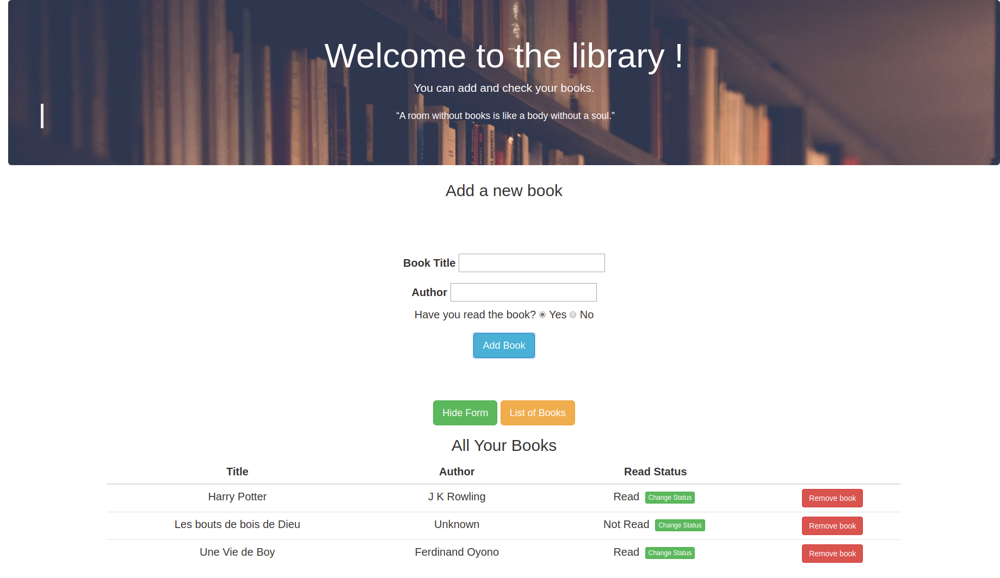

# Library App
A JavaScript application to help users keep track of their books.

## Technologies

- HTML
- CSS
- JavaScript

## Functionalities

Can be found on: ( <a href="https://www.theodinproject.com/courses/javascript/lessons/library"> The Odin Library Project </a>)

The user can:

- Add new books to the library
- Remove books from the library
- Change the status of the book (read or not read)

## Developed by

Mouhamadou Diouf ( <a href="https://github.com/MouhaDiouf"> @mouhad </a>)
Michael Damulak (<a href="https://github.com/em-em-D"> @emmd </a>)

## Contributing

1. Fork it (https://github.com/MouhaDiouf/library)
2. Create your feature branch (git checkout -b feature/[choose-a-name])
3. Commit your changes (git commit -am 'What this commit will fix/add')
4. Push to the branch (git push origin feature/[chosen name])
5. Create a new Pull Request
